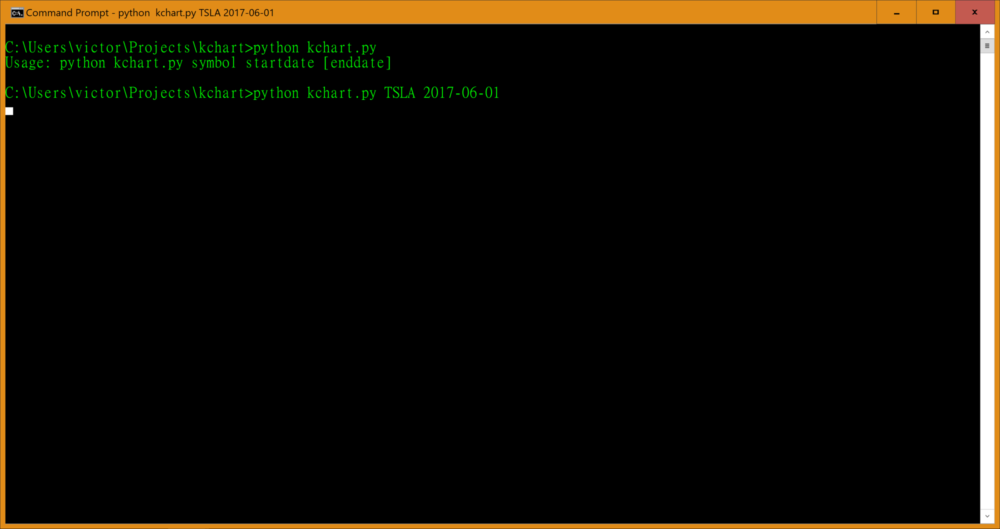
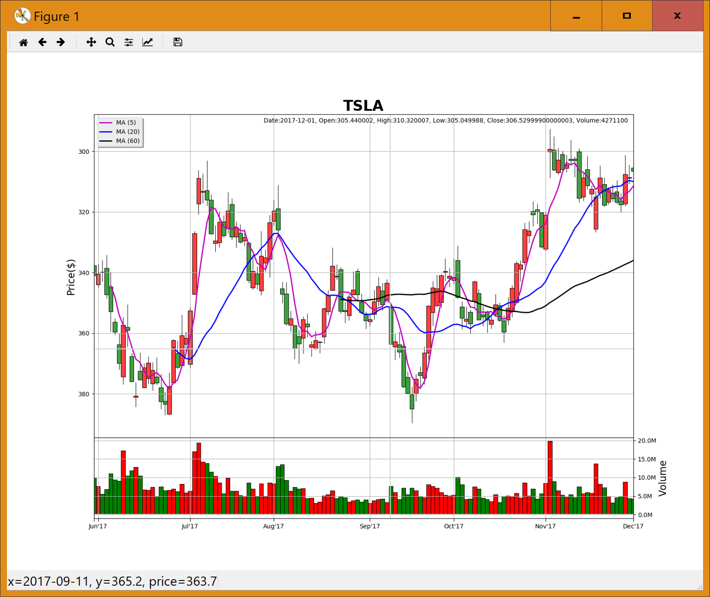

# kchart

Another candlestick plot modified from matploblib.finance.

candlestick() is modified from matplotlib.finance.
volume_overlay() is driectly from matplotlib.finance.

Since finance module is being moved from matplotlib, I copied the code and modified for my own use.

Usage:

